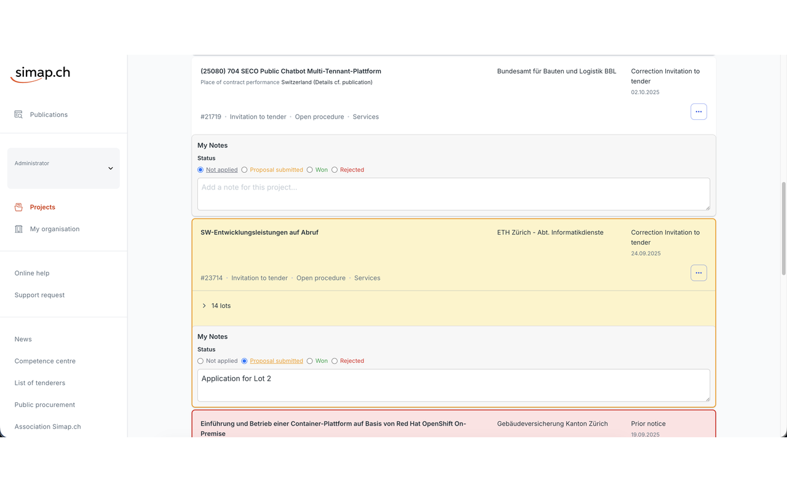

# SIMAP Project Notes

Enhance [simap.ch](https://www.simap.ch/) with personal notes and application status tracking directly on each project card. The extension injects an inline notes panel and radio-based status selector (Not applied, Proposal submitted, Won, Rejected), stores data in `localStorage`, and keeps everything in sync while you browse localized German, English, French, or Italian versions of SIMAP.

<p align="center">
  
</p>

## Features

- Per-project notes saved locally in the browser.
- Quick status toggles with color-coded highlights on cards.
- SPA-aware language support: labels switch automatically when you change `/de`, `/en`, `/fr`, or `/it` without reloading.
- Mutation observer keeps up with dynamically loaded results.
- Localized extension name/description and UI copy (DE/EN/FR/IT).

## Development

```bash
# edit source files under scripts/ and styles/

# To load extension in Chrome:
# 1. chrome://extensions
# 2. Enable Developer Mode
# 3. Load unpacked -> select repo directory
# 4. Visit https://www.simap.ch/ to search or open your project manager view

# After any code change, click the ⟳ Reload button on the SIMAP Project Notes
# card in chrome://extensions (not just browser refresh) before reloading the site.
```

## Deployment

### Local release workflow

```bash
./deploy.sh
# prompts for the next x.y.z version, bumps manifest.json,
# commits, tags (vX.Y.Z), and writes dist/simap-project-notes-x.y.z.zip
```

### CI pipeline (GitHub Actions)

1. Ensure `manifest.json` already carries the desired release version (e.g. `1.2.0`).
   - Edit the manifest, commit the change, and push it before tagging.
2. Push a tag named `v1.2.0` (matching the manifest version) to GitHub:
   - `git push origin v1.2.0`
> Alternatively, run `./deploy.sh --version 1.2.0` to bump the manifest and create the commit/tag locally, then push both.
3. The `Build Release` workflow runs automatically, reuses `deploy.sh --ci`, and attaches
   `dist/simap-project-notes-1.2.0.zip` to the GitHub Release created from that tag.
